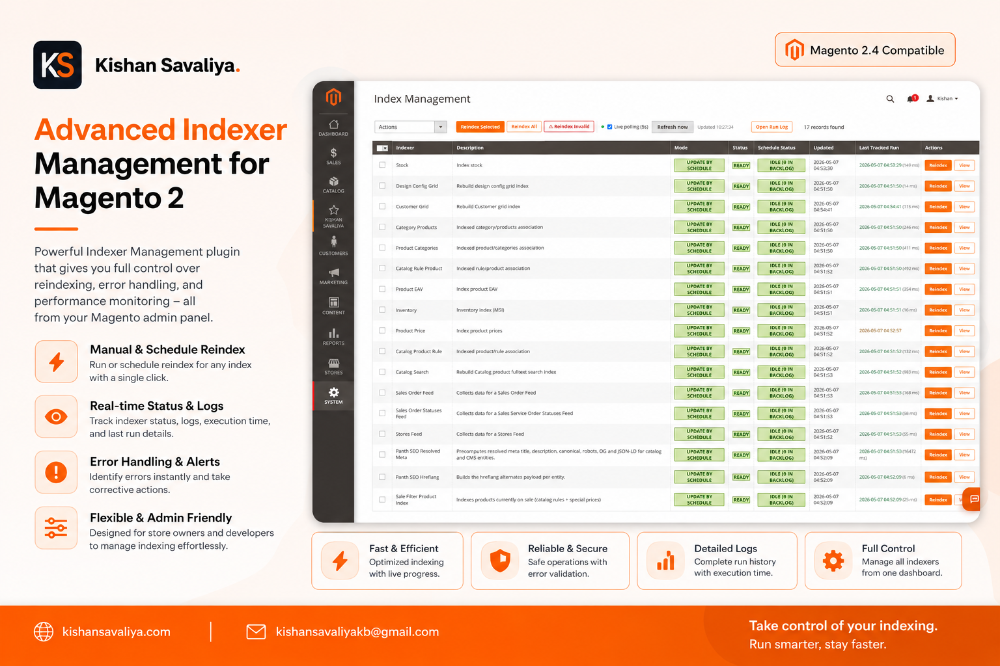
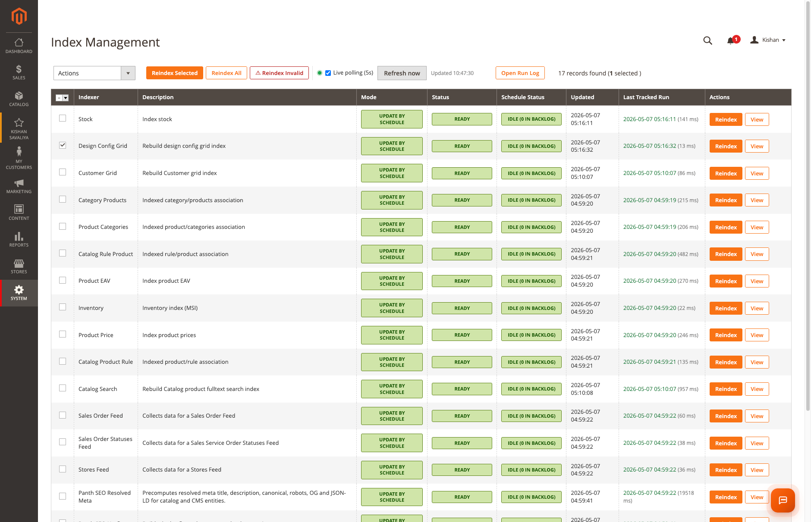
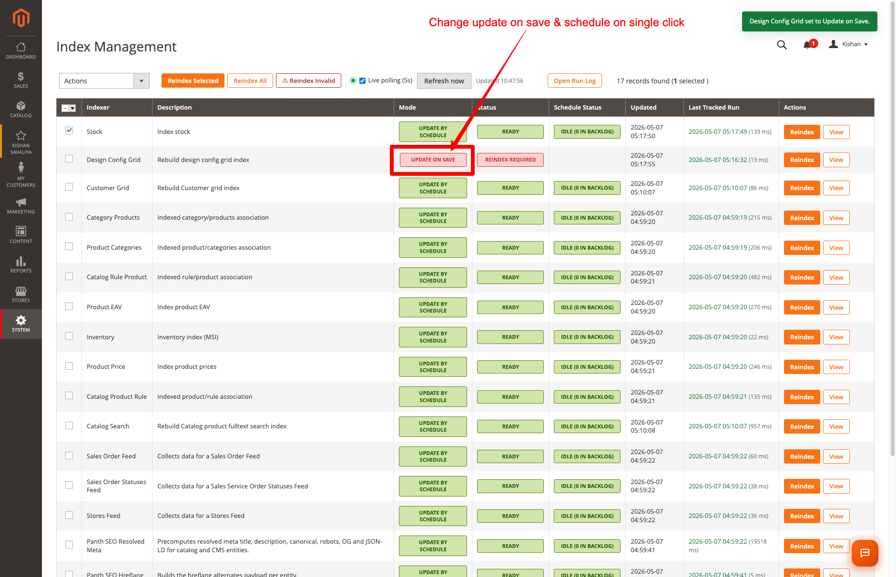
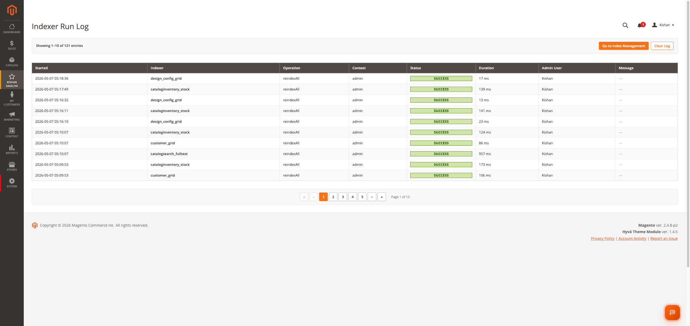
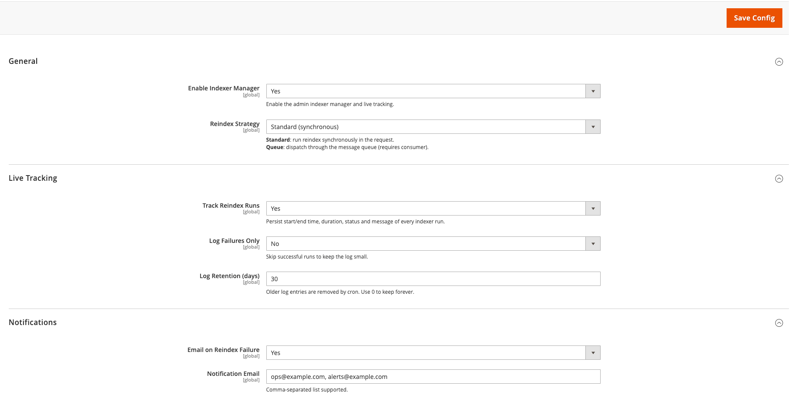
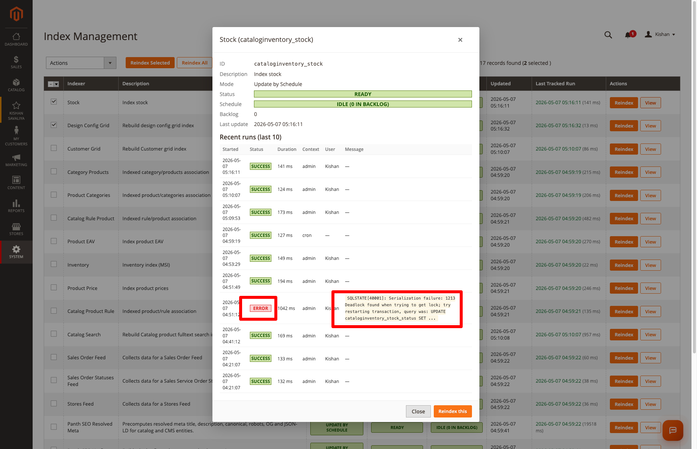

<!-- SEO Meta -->
<!--
  Title: Magento 2 Indexer Manager: Reindex from Admin, Live Tracking & Run Log | Panth Infotech
  Description: Panth Indexer Manager lets you reindex Magento 2 from the admin without touching the terminal. Per-row Reindex and View buttons, mass actions, one-click mode toggle, live status polling, full run history with duration and error messages, retention cron, queue strategy, and email alerts on failure. Works on Magento 2.4.4 to 2.4.8 and PHP 8.1 to 8.4.
  Keywords: magento 2 reindex from admin, magento 2 indexer manager, magento 2 reindex button, magento 2 indexer log, magento 2 reindex history, magento 2 indexer admin ui, magento 2 reindex tracker, magento 2 reindex queue, magento 2 indexer email alert, magento admin reindex extension
  Author: Kishan Savaliya (Panth Infotech)
  Canonical: https://kishansavaliya.com/magento-2-indexer-manager.html
-->

# Magento 2 Indexer Manager: Reindex from Admin with Live Tracking and Run Log (Hyva + Luma)

[](https://magento.com)
[](https://php.net)
[](https://www.hyva.io)
[](https://kishansavaliya.com/magento-2-indexer-manager.html)
[](https://packagist.org/packages/mage2kishan/module-indexer-manager)
[](https://www.upwork.com/freelancers/~016dd1767321100e21)
[](https://kishansavaliya.com)

> **Reindex Magento 2 from the admin without opening a terminal.** Panth Indexer Manager adds per-row Reindex and View buttons to Magento's native Index Management page, plus mass actions, a one-click mode toggle, live status polling, and a full run log that captures every reindex from admin, CLI, cron, and API calls.

**Product page:** [kishansavaliya.com/magento-2-indexer-manager.html](https://kishansavaliya.com/magento-2-indexer-manager.html)



---

## Quick Answer

**What is Panth Indexer Manager?** It is a Magento 2 admin extension that adds reindex buttons and a run history log to the native Index Management page, so store owners and content editors can reindex without SSH access.

**What does it add to my store?**

- A **per-row Reindex button** and a **View details modal** on every indexer in the grid.
- **Three mass action buttons**: Reindex Selected, Reindex All, and Reindex Invalid.
- A **one-click mode toggle** to flip an indexer between Update by Schedule and Update on Save.
- **Live status polling** every 5 seconds with a manual Refresh button.
- A **Run Log** that records every reindex (admin, CLI, cron, or API) with duration, context, and error messages.
- **Email alerts** when a reindex fails.

**Which themes are supported?** This module is admin-only and does not touch the storefront, so it works the same on **Hyva**, **Luma**, or any custom theme.

**What does it need?** Magento 2.4.4 to 2.4.8, PHP 8.1 to 8.4, and the free `mage2kishan/module-core` package.

---

## 🚀 Need Custom Magento 2 Development?

> **Get a free quote for your project in 24 hours** for custom modules, Hyva themes, performance work, M1 to M2 migrations, and Adobe Commerce Cloud.

<p align="center">
  <a href="https://kishansavaliya.com/get-quote">
    
  </a>
</p>

<table>
<tr>
<td width="50%" align="center">

### 🏆 Kishan Savaliya
**Top Rated Plus on Upwork**

[](https://www.upwork.com/freelancers/~016dd1767321100e21)

100% Job Success • 10+ Years Magento Experience
Adobe Certified • Hyva Specialist

</td>
<td width="50%" align="center">

### 🏢 Panth Infotech Agency
**Magento Development Team**

[](https://www.upwork.com/agencies/1881421506131960778/)

Custom Modules • Theme Design • Migrations
Performance • SEO • Adobe Commerce Cloud

</td>
</tr>
</table>

**Visit our website:** [kishansavaliya.com](https://kishansavaliya.com) &nbsp;|&nbsp; **Get a quote:** [kishansavaliya.com/get-quote](https://kishansavaliya.com/get-quote)

---

## Table of Contents

- [Who Is It For](#who-is-it-for)
- [Key Features](#key-features)
- [Compatibility](#compatibility)
- [Installation](#installation)
- [Configuration](#configuration)
- [How It Works](#how-it-works)
- [Run Log and Retention](#run-log-and-retention)
- [FAQ](#faq)
- [Support](#support)
- [About Panth Infotech](#about-panth-infotech)
- [Quick Links](#quick-links)

---

## Who Is It For

- **Store owners and operations teams** who need to reindex after a content change but should not need SSH or CLI access to do it.
- **Content editors and merchandisers** who save category changes, update prices, or modify tax rules and then need to flush a specific indexer without calling a developer.
- **Developers and DevOps teams** who want a full audit trail of every reindex across admin, CLI, cron, and API so they can debug failures and track timing.
- **High-traffic stores** that use the queue strategy to push long reindexes to a background consumer instead of blocking the admin request.
- **Any Magento store** that wants email alerts when a reindex throws an error, without checking log files manually.

---

## Key Features

### Reindex Buttons on the Admin Grid

- **Per-row Reindex button** on every indexer in the native System → Index Management grid.
- **Per-row View button** that opens a details modal with status, schedule, backlog count, and the last 10 tracked runs for that indexer.
- **Optimistic UI** - the affected rows flip to PROCESSING with a spinner the moment you click, so you know the action registered.
- **Top-right toast notifications** for every action, whether success or error.



### Mass Actions

- **Reindex Selected** runs only the rows you have ticked.
- **Reindex All** runs all indexers in one shot.
- **Reindex Invalid** runs only the indexers currently in Reindex required state.
- All three buttons sit in a toolbar injected next to the native Actions dropdown, so nothing is hidden.

### One-Click Mode Toggle

- Click any **Mode** cell to flip an indexer between **Update by Schedule** and **Update on Save** without opening any dropdown or reloading the page.



### Live Status Polling

- The grid polls for status updates every **5 seconds** with a green pulsing indicator.
- A manual **Refresh now** button and a `Updated HH:MM:SS` timestamp are always visible.

### Full Run Log

- Every reindex in the system is captured - **admin clicks, CLI commands, cron schedule runs, and programmatic API calls** - all recorded by a plugin around `Magento\Indexer\Model\Indexer`.
- The Run Log grid shows Started, Indexer, Operation, Context, Status, Duration, Admin User, and Message.
- **Error messages are stored in full** so you can debug without reproducing the failure.
- **One-click Clear Log** to wipe all entries.



### Reindex Strategies

- **Standard (synchronous)** - runs reindex in the request thread and returns when finished. This is the default and matches Magento's built-in behavior.
- **Queue (deferred)** - publishes to the `panth.indexer_manager.reindex` message-queue topic. The admin gets a "queued" toast immediately and the reindex runs in the background via a consumer.

### Retention and Email Alerts

- **Daily retention cron** prunes old log entries by age. Set to 0 to keep forever.
- **Failures-only mode** skips successful runs so the log stays small.
- **Failure email alerts** send an HTML email with indexer ID, context, admin user, duration, and the full error message when a reindex throws an exception.

### Built to Last

- **MEQP-style code** with strict types, typed properties, PSR-4 autoloading, and no `var_dump`.
- **No core overrides** - extends Magento's native grid via layout XML, column renderers, and a thin JS enhancer.
- **ACL-aware** with three resources (`manage`, `log`, `config`) under Panth Extensions.
- **Translatable** - every label uses Magento's `__()` function and ships with `i18n/en_US.csv`.

---

## Compatibility

| Requirement | Versions Supported |
|---|---|
| Magento Open Source | 2.4.4, 2.4.5, 2.4.6, 2.4.7, 2.4.8 |
| Adobe Commerce | 2.4.4, 2.4.5, 2.4.6, 2.4.7, 2.4.8 |
| Adobe Commerce Cloud | 2.4.4 to 2.4.8 |
| PHP | 8.1.x, 8.2.x, 8.3.x, 8.4.x |
| MySQL | 8.0+ |
| MariaDB | 10.4+ |
| Hyva Theme | Admin-only, no storefront impact |
| Luma Theme | Admin-only, no storefront impact |
| Required Dependency | `mage2kishan/module-core` (free) |

---

## Installation

### Composer Installation (Recommended)

```bash
composer require mage2kishan/module-indexer-manager
bin/magento module:enable Panth_Core Panth_IndexerManager
bin/magento setup:upgrade
bin/magento setup:di:compile
bin/magento setup:static-content:deploy -f
bin/magento cache:flush
```

### Manual Installation via ZIP

1. Download the latest release from [Packagist](https://packagist.org/packages/mage2kishan/module-indexer-manager) or from the [product page](https://kishansavaliya.com/magento-2-indexer-manager.html).
2. Extract it to `app/code/Panth/IndexerManager/` in your Magento install.
3. Make sure `Panth_Core` is installed too (required dependency).
4. Run the commands above starting from `bin/magento module:enable`.

### Verify Installation

```bash
bin/magento module:status Panth_IndexerManager
# Expected: Module is enabled
```

After install, open:
```
Admin → Panth Infotech → Indexer Manager → Index Management
```

---

## Configuration

Go to **Stores → Configuration → Panth Extensions → Indexer Manager**.



| Setting | Group | Default | Description |
|---|---|---|---|
| Enable Indexer Manager | General | Yes | Master switch. When off, run tracking and email notifications are skipped. |
| Reindex Strategy | General | Standard | Standard runs reindex synchronously in the request. Queue dispatches to the message queue and requires the consumer to be running. |
| Track Reindex Runs | Live Tracking | Yes | Persist start and end time, duration, status, and message of every indexer run into the `panth_indexer_manager_run_log` table. |
| Log Failures Only | Live Tracking | No | Skip successful runs to keep the log small. |
| Log Retention (days) | Live Tracking | 30 | Cron prunes entries older than this every day at 03:00. Use 0 to keep forever. |
| Email on Reindex Failure | Notifications | No | When Yes, send an email each time a tracked reindex throws an exception. |
| Notification Email | Notifications | (empty) | Comma-separated list of recipient email addresses. |

All settings apply at the default scope only (indexers are global in Magento).

---

## How It Works

1. The module injects a **toolbar** and extra columns into Magento's native Index Management grid via layout XML and column renderers.
2. When you click a Reindex button, a JavaScript handler sends a POST to the Run controller.
3. The controller calls `IndexerInterface::reindexAll()` directly (Standard strategy) or publishes a message to the queue (Queue strategy).
4. A **plugin around `IndexerInterface`** intercepts every reindex regardless of origin - admin, CLI, cron, or API - and writes a row to `panth_indexer_manager_run_log` with the operation, context, status, duration, and any error message.
5. The Status controller returns a JSON payload for the live polling loop. The grid updates the affected rows every 5 seconds.
6. When a run fails and notifications are enabled, an HTML email is dispatched with the full error detail.

### View Details Modal

Click **View** on any row to see:

- ID, Description, Mode, Status, Schedule status, Backlog count, Last update.
- A table of the **last 10 tracked runs** for that indexer, with Started, Status badge, Duration, Context, Admin User, and the full error message in a code block.



### Run Log Page

Open **Admin → Panth Infotech → Indexer Manager → Run Log**.

- 10 entries per page, newest first.
- Status badges: SUCCESS (green), ERROR (red), RUNNING (yellow).
- Error messages in monospace code blocks.
- **Go to Index Management** and **Clear Log** buttons at the top right.

---

## Run Log and Retention

The `panth_indexer_manager_run_log` table stores every captured run.

| Column | Type | Notes |
|---|---|---|
| `log_id` | int unsigned | Primary key |
| `indexer_id` | varchar(64) | e.g. `catalog_product_price` |
| `operation` | varchar(32) | `reindexAll` / `reindexRow` / `reindexList` |
| `context` | varchar(32) | `admin` / `cli` / `cron` / `api` / `unknown` |
| `status` | varchar(16) | `running` / `success` / `error` |
| `started_at` | datetime | UTC |
| `finished_at` | datetime | UTC, nullable |
| `duration_ms` | int unsigned | nullable |
| `message` | text | Exception message on error |
| `admin_user` | varchar(128) | Username if triggered from admin |

Indexes on `indexer_id`, `started_at`, and `status` keep the grid fast even with large tables.

Retention is enforced by the daily cron `panth_indexer_manager_cleanup_run_log` (runs at 03:00 in the default group). Set **Log Retention (days) = 0** to keep entries forever.

---

## FAQ

### Does this module work on Hyva storefronts?

Yes. The module is admin-only and does not touch the storefront. It works identically on Hyva, Luma, Breeze, or any custom theme.

### Will the reindex buttons appear for custom indexers?

Yes, as long as the custom indexer is registered in `etc/indexer.xml` and follows Magento conventions. The buttons are rendered for every row in the native Index Management grid.

### Does it track CLI reindexes too?

Yes. `bin/magento indexer:reindex` goes through `IndexerInterface`, which the module's plugin wraps, so CLI runs appear in the Run Log with `context = cli`.

### What about cron-driven reindexes?

Same - Magento's `indexer_reindex_all_invalid` and `indexer_update_all_views` cron jobs run through the same interface, so those runs appear with `context = cron`.

### Is the queue strategy safe for production?

Yes. It uses Magento's standard MessageQueue framework with the DB connection by default, so no RabbitMQ or AMQP infrastructure is required. You can switch to RabbitMQ by editing `etc/queue_publisher.xml` if you need higher throughput.

### Will it slow down my admin?

No. The grid renderers are O(n) over the indexer list (about 17 entries by default) and the live-poll endpoint returns a single small JSON response. Tracking adds one INSERT and one UPDATE per reindex.

### Can I keep the log small?

Yes. Turn on **Log Failures Only** to skip successful runs. Set **Log Retention (days)** to a low number to prune old entries automatically, or use **Clear Log** to wipe everything at once.

### Is Panth Core required?

Yes. `mage2kishan/module-core` is a free required dependency that Composer installs for you automatically.

### Does it work with multi-store setups?

Yes. Indexers are global in Magento, but the failure notification email is sent using the store identity from which the admin request originated.

---

## Support

| Channel | Contact |
|---|---|
| Product Page | [kishansavaliya.com/magento-2-indexer-manager.html](https://kishansavaliya.com/magento-2-indexer-manager.html) |
| Email | kishansavaliyakb@gmail.com |
| Website | [kishansavaliya.com](https://kishansavaliya.com) |
| WhatsApp | +91 84012 70422 |
| GitHub Issues | [github.com/mage2sk/module-indexer-manager/issues](https://github.com/mage2sk/module-indexer-manager/issues) |
| Upwork (Top Rated Plus) | [Hire Kishan Savaliya](https://www.upwork.com/freelancers/~016dd1767321100e21) |
| Upwork Agency | [Panth Infotech](https://www.upwork.com/agencies/1881421506131960778/) |

Response time: 1-2 business days.

### Need Custom Magento Development?

Looking for **custom Magento module development**, **Hyva theme work**, **store migrations**, or **performance tuning**? Get a free quote in 24 hours:

<p align="center">
  <a href="https://kishansavaliya.com/get-quote">
    
  </a>
</p>

<p align="center">
  <a href="https://www.upwork.com/freelancers/~016dd1767321100e21">
    
  </a>
  &nbsp;&nbsp;
  <a href="https://www.upwork.com/agencies/1881421506131960778/">
    
  </a>
  &nbsp;&nbsp;
  <a href="https://kishansavaliya.com/magento-2-indexer-manager.html">
    
  </a>
</p>

---

## About Panth Infotech

Built and maintained by **Kishan Savaliya** ([kishansavaliya.com](https://kishansavaliya.com)), a **Top Rated Plus** Magento developer on Upwork with 10+ years of eCommerce experience.

**Panth Infotech** is a Magento 2 development agency that builds high quality, security focused extensions and themes for both Hyva and Luma storefronts. The extension suite covers SEO, performance, checkout, product presentation, customer engagement, and store management, with each module built to MEQP standards and tested across Magento 2.4.4 to 2.4.8.

Browse the full extension catalog on our [Magento extensions page](https://kishansavaliya.com/magento-extensions.html) or on [Packagist](https://packagist.org/packages/mage2kishan/).

---

## Quick Links

| Resource | Link |
|---|---|
| 🛒 **Product Page** | [magento-2-indexer-manager.html](https://kishansavaliya.com/magento-2-indexer-manager.html) |
| 📦 **Packagist** | [mage2kishan/module-indexer-manager](https://packagist.org/packages/mage2kishan/module-indexer-manager) |
| 🐙 **GitHub** | [mage2sk/module-indexer-manager](https://github.com/mage2sk/module-indexer-manager) |
| 🌐 **Website** | [kishansavaliya.com](https://kishansavaliya.com) |
| 💬 **Free Quote** | [kishansavaliya.com/get-quote](https://kishansavaliya.com/get-quote) |
| 👨‍💻 **Upwork (Top Rated Plus)** | [Hire Kishan Savaliya](https://www.upwork.com/freelancers/~016dd1767321100e21) |
| 🏢 **Upwork Agency** | [Panth Infotech](https://www.upwork.com/agencies/1881421506131960778/) |
| 📧 **Email** | kishansavaliyakb@gmail.com |
| 📱 **WhatsApp** | +91 84012 70422 |

---

<p align="center">
  <strong>Stop SSH-ing in to reindex. Click a button instead.</strong><br/>
  <a href="https://kishansavaliya.com/magento-2-indexer-manager.html">
    
  </a>
</p>

---

**SEO Keywords:** magento 2 reindex from admin, magento 2 indexer manager, magento 2 reindex button, magento 2 indexer log, magento 2 reindex history, magento 2 indexer admin ui, magento 2 reindex tracker, magento 2 reindex queue, magento 2 indexer email alert, magento 2 indexer notification, magento 2 indexer dashboard, magento 2 reindex from backend, magento 2 indexer run log, magento 2 reindex without terminal, hyva indexer admin, magento 2 update on save toggle, magento 2 update by schedule toggle, magento 2 reindex selected, magento 2 reindex all, magento 2 reindex invalid, magento 2 indexer mode toggle, magento 2.4.8 reindex extension, magento 2 php 8.4 indexer, magento admin reindex extension, magento 2 indexer module, magento 2 indexer history log, mage2kishan indexer manager, panth infotech indexer manager, kishan savaliya magento, hire magento developer upwork, top rated plus magento freelancer, custom magento development, adobe commerce indexer admin
