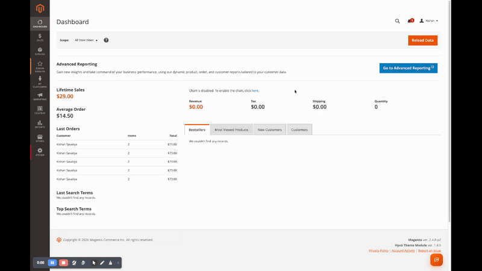

<!-- SEO Meta -->
<!--
  Title: Panth Indexer Manager - Reindex from Admin with Live Tracking & Run Log for Magento 2 | Panth Infotech
  Description: Panth Indexer Manager runs and tracks Magento 2 indexers from the admin. Per-row Reindex / View buttons, mass actions (Selected / All / Invalid), one-click Update by Schedule ⇄ Update on Save toggle, live status polling, full run history with duration, context (admin/cli/cron/api) and error message, retention cron, optional message-queue strategy, and email-on-failure notifications. Compatible with Magento 2.4.4 - 2.4.8, PHP 8.1 - 8.4.
  Keywords: magento 2 reindex from admin, magento 2 indexer manager, magento 2 reindex button, magento 2 reindex log, magento 2 indexer history, magento 2 reindex queue, magento 2 indexer email alert, hyva indexer admin, magento admin reindex
  Author: Kishan Savaliya (Panth Infotech)
  Canonical: https://github.com/mage2sk/module-indexer-manager
-->

# Panth Indexer Manager — Reindex Magento 2 from the Admin with Live Tracking | Panth Infotech

[](https://magento.com)
[](https://php.net)
[](https://www.hyva.io)
[](https://packagist.org/packages/mage2kishan/module-indexer-manager)
[](https://github.com/mage2sk/module-indexer-manager)
[](https://www.upwork.com/freelancers/~016dd1767321100e21)
[](https://www.upwork.com/agencies/1881421506131960778/)
[](https://kishansavaliya.com)

> **Reindex Magento 2 from the admin — without ever opening a terminal.** Per-row Reindex + View buttons, three top-row mass actions (Selected / All / Invalid), one-click Mode toggle, live status polling, full searchable run history with duration & error message, retention cron, optional message-queue strategy, and email alerts on failure.

**Panth Indexer Manager** drops a thin layer of UX on top of Magento's native Index Management page so admins, store owners, and content editors can run reindexes themselves — safely — and **see exactly what happened** afterwards. Every reindex (whether triggered from the admin, the CLI, cron, or any plugin) is captured into a dedicated **Run Log** with start/end timestamps, duration in milliseconds, context (admin / cli / cron / api), the admin user who triggered it, and the full error message if it failed.


---

## 🚀 Need Custom Magento 2 Development?

> **Get a free quote for your project in 24 hours** — custom modules, Hyva themes, performance optimization, M1→M2 migrations, and Adobe Commerce Cloud.

<p align="center">
  <a href="https://kishansavaliya.com/get-quote">
    
  </a>
</p>

<table>
<tr>
<td width="50%" align="center">

### 🏆 Kishan Savaliya
**Top Rated Plus on Upwork**

[](https://www.upwork.com/freelancers/~016dd1767321100e21)

100% Job Success • 10+ Years Magento Experience
Adobe Certified • Hyva Specialist

</td>
<td width="50%" align="center">

### 🏢 Panth Infotech Agency
**Magento Development Team**

[](https://www.upwork.com/agencies/1881421506131960778/)

Custom Modules • Theme Design • Migrations
Performance • SEO • Adobe Commerce Cloud

</td>
</tr>
</table>

**Visit our website:** [kishansavaliya.com](https://kishansavaliya.com) &nbsp;|&nbsp; **Get a quote:** [kishansavaliya.com/get-quote](https://kishansavaliya.com/get-quote)

---

## See it in action



> Reindex Selected, View modal, click-to-toggle Mode, live status polling, and the Run Log — all from the native Index Management page.

---

## Table of Contents

- [Key Features](#key-features)
- [Why You Want This](#why-you-want-this)
- [Compatibility](#compatibility)
- [Installation](#installation)
- [Configuration](#configuration)
- [Admin UI Tour](#admin-ui-tour)
- [Reindex Strategies](#reindex-strategies)
- [Run Log & Retention](#run-log--retention)
- [Email Notifications](#email-notifications)
- [Troubleshooting](#troubleshooting)
- [FAQ](#faq)
- [Support](#support)
- [About Panth Infotech](#about-panth-infotech)
- [Quick Links](#quick-links)

---

## Key Features

### Reindex from the admin — with proper UX

- **Per-row Reindex button** on every indexer in Magento's native **System → Index Management** grid
- **Per-row View button** opens a details modal with status, schedule, backlog, and the **last 10 runs** for that indexer
- **Three top-row mass actions** next to the native Actions dropdown:
  - **Reindex Selected** — primary orange — runs the rows you've ticked
  - **Reindex All** — outline orange — runs all 17+ indexers in one shot
  - **Reindex Invalid** — outline red with ⚠ — runs only rows currently in *Reindex required* state
- **Optimistic UI** — the moment you click, the affected rows flip to `PROCESSING` with a spinner; you never wonder if the click registered
- **One-click Mode toggle** on the Mode cell — flip an indexer between **Update by Schedule** and **Update on Save** in a single click, no mass-action dropdown gymnastics
- **Top-right toast feedback** for every action — success / error / info
- **Live status polling** every 5 seconds with a green pulsing indicator, manual **Refresh now** button, and `Updated HH:MM:SS` timestamp

### Full Run History (Run Log)

- Every reindex anywhere in the system is captured — **admin clicks, CLI commands (`bin/magento indexer:reindex`), cron schedule runs, programmatic API calls** — all recorded by a plugin around `Magento\Indexer\Model\Indexer`
- **Started, Indexer, Operation, Context, Status, Duration, Admin User, Message** — all visible in a clean paginated grid (10 per page)
- **Error messages** preserved in full — when an indexer fails, the exception trace lands in the log so you can debug without having to reproduce
- **Per-indexer history** in the View modal — see the last 10 runs for any single indexer
- **One-click Clear Log** to wipe everything

### Strategy Choices

- **Standard (synchronous)** — runs reindex in the request thread, returns when finished (default; matches Magento's built-in behaviour)
- **Queue (deferred)** — publishes to the `panth.indexer_manager.reindex` message-queue topic, processed by the consumer; the admin gets a "queued" toast immediately and the reindex runs in the background

### Retention & Notifications

- **Daily retention cron** — old log entries are pruned by age (configurable per day count, set to `0` to keep forever)
- **Failure email alerts** — when a reindex fails, an email is sent to one or more recipients with the indexer ID, context, admin user, full error message, and a link back to the store
- **Failures-only mode** — keep the log small by only recording failed runs

### Built right

- **MEQP-style code** — typed properties, strict_types, PSR-4, escapers, no `var_dump`s
- **No core overrides** — extends Magento's native grid via layout XML + column renderers + a thin JS enhancer
- **Hyva-friendly** — admin only, doesn't touch the storefront
- **Translatable** — every label goes through `__()`, ships with `i18n/en_US.csv`
- **ACL-aware** — three resources (`manage`, `log`, `config`) under `Panth Extensions`

---

## Why You Want This

Reindexing in Magento is a daily reality — flush cache, save a category tree, change tax rules, deploy to staging — and the *out-of-the-box* tooling for non-developers is brutal:

1. **The native Index Management grid has no per-row Reindex button.** You either tick the row, find the right mass action, hit Submit, then re-read the page to see if it worked — or SSH in and run `bin/magento indexer:reindex catalog_product_attribute`, which most ops people can't or shouldn't do.
2. **There is no history.** A reindex either silently succeeds or quietly fails; the only way to investigate is to scroll `var/log/exception.log` *if* exceptions happened to be logged.
3. **There's no live feedback.** A long reindex blocks your tab and you have no idea if it's working or hung.

Panth Indexer Manager fixes all three:

- Reindex any single indexer in **one click**.
- Every run is **recorded** with duration and error.
- The grid **updates live** every 5 seconds, and the row you clicked flashes to `PROCESSING` immediately.

It's the same UX shoppers are used to in modern admin tools — applied to one of Magento's most-used pages.

---

## Compatibility

| Requirement | Versions Supported |
|---|---|
| Magento Open Source | 2.4.4, 2.4.5, 2.4.6, 2.4.7, 2.4.8 |
| Adobe Commerce | 2.4.4, 2.4.5, 2.4.6, 2.4.7, 2.4.8 |
| Adobe Commerce Cloud | 2.4.4 — 2.4.8 |
| PHP | 8.1.x, 8.2.x, 8.3.x, 8.4.x |
| MySQL | 8.0+ |
| MariaDB | 10.4+ |
| Hyva Theme | Admin-only — no storefront impact |
| Luma Theme | Admin-only — no storefront impact |
| Required Dependency | `mage2kishan/module-core` ^1.0 |

---

## Installation

### Composer Installation (Recommended)

```bash
composer require mage2kishan/module-indexer-manager
bin/magento module:enable Panth_Core Panth_IndexerManager
bin/magento setup:upgrade
bin/magento setup:di:compile
bin/magento setup:static-content:deploy -f
bin/magento cache:flush
```

### Manual Installation via ZIP

1. Download the latest release ZIP from [Packagist](https://packagist.org/packages/mage2kishan/module-indexer-manager) or [GitHub Releases](https://github.com/mage2sk/module-indexer-manager/releases).
2. Extract the contents to `app/code/Panth/IndexerManager/` in your Magento installation.
3. Ensure `Panth_Core` is installed (required dependency).
4. Run the same commands as above starting from `bin/magento module:enable`.

### Verify Installation

```bash
bin/magento module:status Panth_IndexerManager
# Expected: Module is enabled
```

---

## Configuration

Navigate to **Admin → Stores → Configuration → Panth Extensions → Indexer Manager**.


| Section | Setting | Default | Description |
|---|---|---|---|
| **General** | Enable Indexer Manager | Yes | Master switch. When off, run tracking and email notifications are skipped (admin reindex actions still work). |
| **General** | Reindex Strategy | Standard | `Standard` runs reindex synchronously in the request. `Queue` dispatches to the `panth.indexer_manager.reindex` topic — requires the consumer to be running. |
| **Live Tracking** | Track Reindex Runs | Yes | Persist start/end time, duration, status, and message of every indexer run into the `panth_indexer_manager_run_log` table. |
| **Live Tracking** | Log Failures Only | No | Skip successful runs entirely. Keeps the log tiny if you only care about errors. |
| **Live Tracking** | Log Retention (days) | 30 | Cron prunes entries older than this every day at 03:00. Use `0` to keep forever. |
| **Notifications** | Email on Reindex Failure | No | When `Yes`, send an email each time a tracked reindex throws an exception. |
| **Notifications** | Notification Email | (empty) | Comma-separated list of recipients. |

All settings respect Magento's standard scope hierarchy (default → website → store view) where applicable.

---

## Admin UI Tour

### Manage Indexers — three new columns + a top-row toolbar


Panth Indexer Manager extends Magento's native **Index Management** page with:

- A new **Last Tracked Run** column showing the most recent run timestamp + duration
- A new **Actions** column with per-row **Reindex** (filled orange) and **View** (outline orange) buttons
- A normalized **Status** badge sized to match Mode and Schedule Status visually
- A **top-row toolbar** injected next to the native Actions dropdown:
  - Reindex Selected / All / Invalid mass buttons
  - Live polling toggle with green pulsing indicator
  - Refresh now button + last-update timestamp
  - Open Run Log link

### View Details modal — recent run history per indexer


Click **View** on any row to see:

- ID, Description, Mode, Status, Schedule status, Backlog count, Last update
- A table of the **last 10 tracked runs** for that indexer, with Started, Status badge, Duration, Context, Admin User, and the full Message (rendered as a `<code>` block for error traces)

### One-click Mode toggle


Click any **Mode** cell to flip between *Update by Schedule* and *Update on Save* — no mass-action dropdown, no Submit, no page reload.

### Run Log — paginated, searchable, exportable


Every reindex anywhere in the system is captured here:

- 10 entries per page, newest first, with Magento-styled pager (`«` `‹` `1 2 3 4 5` `›` `»`)
- Status badges: `SUCCESS` (green), `ERROR` (red), `RUNNING` (yellow)
- Error messages rendered as monospace code blocks for legibility
- **Go to Index Management** button (orange) and **Clear Log** button (outline) at the top right

---

## Reindex Strategies

### Standard (default)

```
admin clicks Reindex → Run controller → IndexerInterface::reindexAll() → response
```

Runs synchronously in the request. Best for fast indexers (< 1 second). Same code path as Magento's native mass action.

### Queue (deferred)

```
admin clicks Reindex → Run controller → publish to panth.indexer_manager.reindex
                                              ↓
       ReindexConsumer ← message broker (DB queue, AMQP-compatible)
```

Best for long-running indexers (full catalog reindex, search rebuild). Returns immediately to the admin with a "queued" toast. To drain the queue:

```bash
bin/magento queue:consumers:start panth.indexer_manager.reindex
```

Or run it as a cron-driven consumer (see [Magento docs](https://devdocs.magento.com/guides/v2.4/extension-dev-guide/message-queues/manage-mysql.html)).

The tracking plugin records the run regardless of which strategy is in use, because it wraps `IndexerInterface` itself.

---

## Run Log & Retention

The `panth_indexer_manager_run_log` table stores every captured run with:

| Column | Type | Notes |
|---|---|---|
| `log_id` | int unsigned | PK |
| `indexer_id` | varchar(64) | e.g. `catalog_product_price` |
| `operation` | varchar(32) | `reindexAll` / `reindexRow` / `reindexList` |
| `context` | varchar(32) | `admin` / `cli` / `cron` / `api` / `unknown` |
| `status` | varchar(16) | `running` / `success` / `error` |
| `started_at` | datetime | UTC |
| `finished_at` | datetime | UTC, nullable |
| `duration_ms` | int unsigned | nullable |
| `message` | text | exception message on error |
| `admin_user` | varchar(128) | username if triggered from admin |

Indexes on `indexer_id`, `started_at`, and `status` keep the grid responsive even with hundreds of thousands of rows.

Retention is enforced by the daily cron `panth_indexer_manager_cleanup_run_log` (runs at 03:00 in the default group). Set **Log Retention (days) = 0** to keep entries forever.

---

## Email Notifications

When a reindex fails *and* notifications are enabled *and* at least one recipient is configured, an HTML email is sent containing:

- Indexer ID, operation, context
- Started / finished / duration
- Admin user (if applicable)
- Store name + base URL
- Full error message in a preformatted block

The email template is registered as `panth_indexer_manager_failure` and lives at `view/frontend/email/reindex_failure.html` — override it in your theme if you want to brand the message.

The default sender is the store's `trans_email/ident_general` identity (Stores → Configuration → General → Store Email Addresses).

---

## Troubleshooting

| Issue | Cause | Resolution |
|---|---|---|
| Buttons not appearing on Index Management page | Static content not deployed | `bin/magento setup:static-content:deploy -f -a adminhtml en_US && bin/magento cache:flush` |
| ACL not granted to admin user | New ACL resources need re-login | Log out / log in once after install |
| Run Log is empty | Tracking disabled, or Failures Only is on | Enable **Track Reindex Runs**, disable **Failures Only** |
| Queue strategy isn't running anything | Consumer not started | `bin/magento queue:consumers:start panth.indexer_manager.reindex` |
| Failure emails not arriving | SMTP not configured, or email blank | Check **Stores → Configuration → Advanced → System → Mail Sending Settings**, verify the recipient list is non-empty |
| Old log entries not pruning | Cron not running, or retention is `0` | Verify default cron group (`bin/magento cron:run --group=default`), check **Log Retention (days)** |
| Per-row Reindex button doesn't show on a custom indexer | Custom indexer doesn't extend `Magento\Indexer\Model\Indexer` | Ensure the indexer is registered in `etc/indexer.xml` and follows Magento conventions |

---

## FAQ

### Will this slow down my admin?

No. The grid renderers are O(n) over the indexer list (~17 entries by default), and the live-poll endpoint is a single tiny JSON response. Tracking adds one INSERT + one UPDATE per reindex.

### Does it interfere with Magento's CLI reindex?

No — and it actually *adds* tracking to it. `bin/magento indexer:reindex` goes through `IndexerInterface`, which our plugin wraps, so the run shows up in the Run Log with `context = cli`.

### What about cron-driven reindex?

Same — Magento's `indexer_reindex_all_invalid` and `indexer_update_all_views` jobs run through the same interface, so cron-triggered runs appear in the log with `context = cron`.

### Is the queue strategy production-ready?

Yes. It uses Magento's standard MessageQueue framework with the DB connection, so no AMQP / RabbitMQ infrastructure is required. For higher throughput you can switch to RabbitMQ by editing `etc/queue_publisher.xml` to use a different `connection`.

### Does it work on Hyva?

The module is admin-only — it doesn't touch the storefront — so it works identically on Hyva, Luma, Breeze, or any custom theme.

### Can I disable the new columns and keep just the buttons?

Yes — remove the two `<block class="...Column" name="panth.indexer.grid.last_run|actions" ...>` entries from `view/adminhtml/layout/indexer_indexer_list_grid.xml` (you'd typically do this in your custom module via `<referenceBlock remove="true">`).

### Does it work with multi-store?

Yes. Indexers are global in Magento, but the failure-notification email respects the store from which the request originated.

### Is Panth_Core required?

Yes. `mage2kishan/module-core` is a required dependency and is pulled in automatically by Composer.

---

## Support

| Channel | Contact |
|---|---|
| Email | kishansavaliyakb@gmail.com |
| Website | [kishansavaliya.com](https://kishansavaliya.com) |
| WhatsApp | +91 84012 70422 |
| GitHub Issues | [github.com/mage2sk/module-indexer-manager/issues](https://github.com/mage2sk/module-indexer-manager/issues) |
| Upwork (Top Rated Plus) | [Hire Kishan Savaliya](https://www.upwork.com/freelancers/~016dd1767321100e21) |
| Upwork Agency | [Panth Infotech](https://www.upwork.com/agencies/1881421506131960778/) |

Response time: 1-2 business days.

### 💼 Need Custom Magento Development?

Looking for **custom Magento module development**, **Hyva theme customization**, **store migrations**, or **performance optimization**? Get a free quote in 24 hours:

<p align="center">
  <a href="https://kishansavaliya.com/get-quote">
    
  </a>
</p>

<p align="center">
  <a href="https://www.upwork.com/freelancers/~016dd1767321100e21">
    
  </a>
  &nbsp;&nbsp;
  <a href="https://www.upwork.com/agencies/1881421506131960778/">
    
  </a>
  &nbsp;&nbsp;
  <a href="https://kishansavaliya.com">
    
  </a>
</p>

**Specializations:**

- 🛒 **Magento 2 Module Development** — custom extensions following MEQP standards
- 🎨 **Hyva Theme Development** — Alpine.js + Tailwind CSS, lightning-fast storefronts
- 🖌️ **Luma Theme Customization** — pixel-perfect designs, responsive layouts
- ⚡ **Performance Optimization** — Core Web Vitals, page speed, caching strategies
- 🔍 **Magento SEO** — structured data, hreflang, sitemaps, AI-generated meta
- 🛍️ **Checkout Optimization** — one-page checkout, conversion rate optimization
- 🚀 **M1 to M2 Migrations** — data migration, custom feature porting
- ☁️ **Adobe Commerce Cloud** — deployment, CI/CD, performance tuning
- 🔌 **Third-party Integrations** — payment gateways, ERP, CRM, marketing tools

---

## License

Panth Indexer Manager is licensed under a proprietary license — see `LICENSE.txt`. One license per Magento installation.

---

## About Panth Infotech

Built and maintained by **Kishan Savaliya** — [kishansavaliya.com](https://kishansavaliya.com) — a **Top Rated Plus** Magento developer on Upwork with 10+ years of eCommerce experience.

**Panth Infotech** is a Magento 2 development agency specializing in high-quality, security-focused extensions and themes for both Hyva and Luma storefronts. Our extension suite covers SEO, performance, checkout, product presentation, customer engagement, and store management — over 34 modules built to MEQP standards and tested across Magento 2.4.4 to 2.4.8.

Browse the full extension catalog on the [Adobe Commerce Marketplace](https://commercemarketplace.adobe.com) or [Packagist](https://packagist.org/packages/mage2kishan/).

### Quick Links

- 🌐 **Website:** [kishansavaliya.com](https://kishansavaliya.com)
- 💬 **Get a Quote:** [kishansavaliya.com/get-quote](https://kishansavaliya.com/get-quote)
- 👨‍💻 **Upwork Profile (Top Rated Plus):** [upwork.com/freelancers/~016dd1767321100e21](https://www.upwork.com/freelancers/~016dd1767321100e21)
- 🏢 **Upwork Agency:** [upwork.com/agencies/1881421506131960778](https://www.upwork.com/agencies/1881421506131960778/)
- 📦 **Packagist:** [packagist.org/packages/mage2kishan/module-indexer-manager](https://packagist.org/packages/mage2kishan/module-indexer-manager)
- 🐙 **GitHub:** [github.com/mage2sk/module-indexer-manager](https://github.com/mage2sk/module-indexer-manager)
- 🛒 **Adobe Marketplace:** [commercemarketplace.adobe.com](https://commercemarketplace.adobe.com)
- 📧 **Email:** kishansavaliyakb@gmail.com
- 📱 **WhatsApp:** +91 84012 70422

---

<p align="center">
  <strong>Stop SSH-ing in to reindex. Click a button instead.</strong><br/>
  <a href="https://kishansavaliya.com/get-quote">
    
  </a>
</p>

---

**SEO Keywords:** magento 2 reindex from admin, magento 2 indexer manager, magento 2 reindex button, magento 2 indexer log, magento 2 reindex history, magento 2 indexer admin ui, magento 2 reindex tracker, magento 2 reindex queue, magento 2 indexer email alert, magento 2 indexer notification, magento 2 indexer dashboard, magento 2 reindex from backend, magento 2 stop using cli reindex, hyva indexer admin, magento 2 update on save toggle, magento 2 update by schedule toggle, magento 2 reindex selected, magento 2 reindex all, magento 2 reindex invalid, magento 2 indexer mode toggle, magento 2.4.8 reindex extension, magento 2 PHP 8.4 indexer, magento admin reindex extension, magento 2 indexer module, magento 2 indexer history log, mage2kishan indexer manager, panth infotech indexer manager, kishan savaliya magento, hire magento developer upwork, top rated plus magento freelancer, custom magento development, adobe commerce indexer admin
