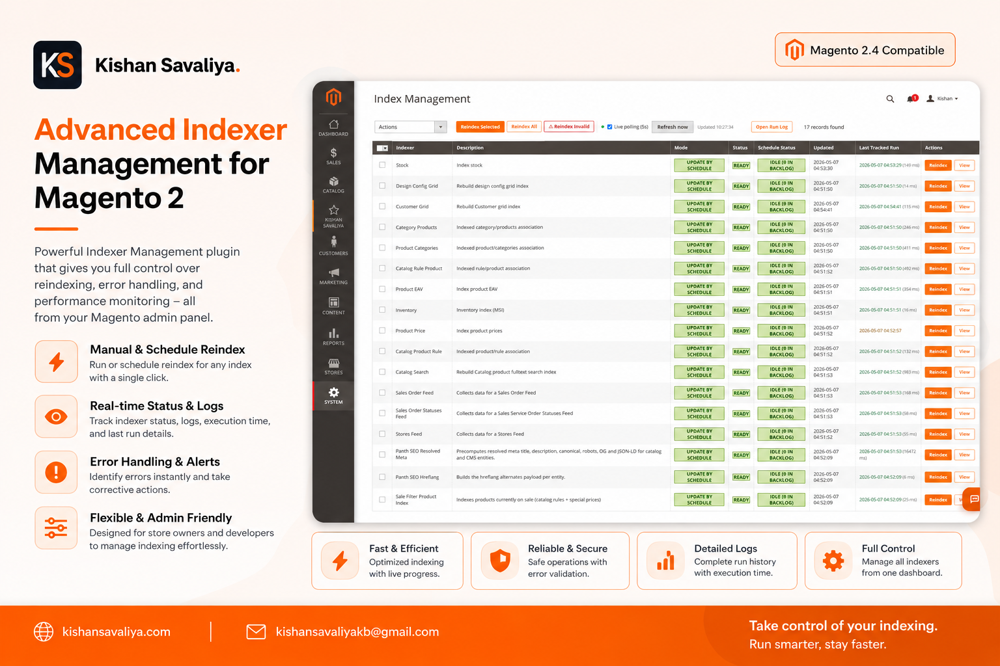
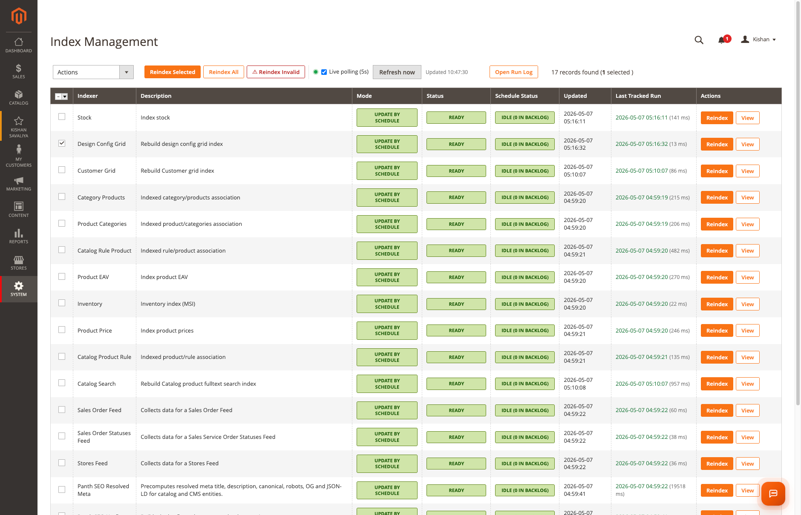
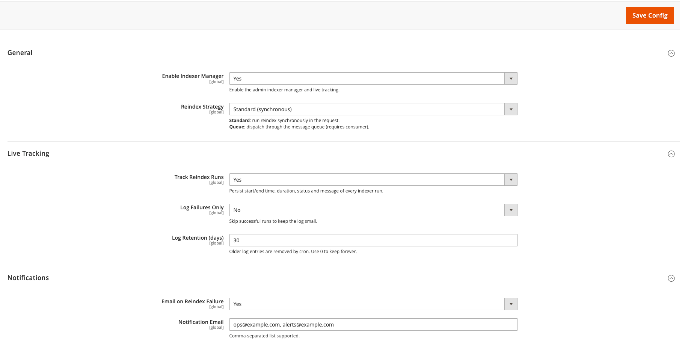
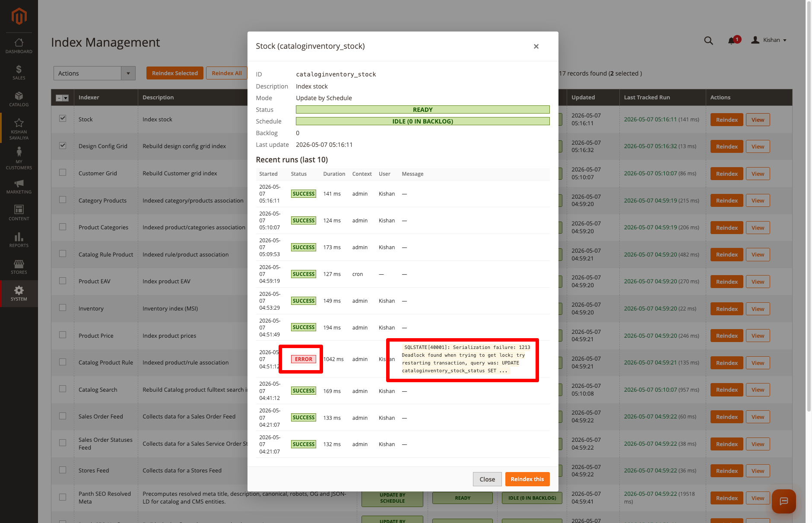
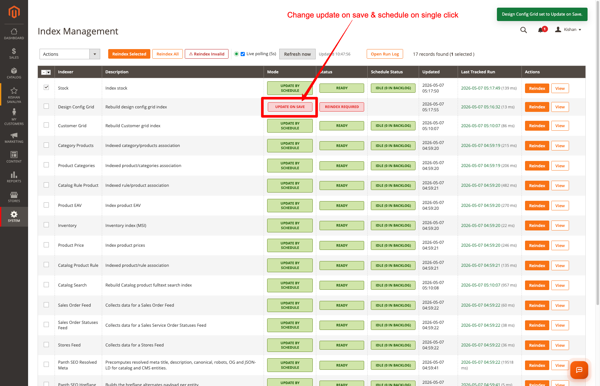
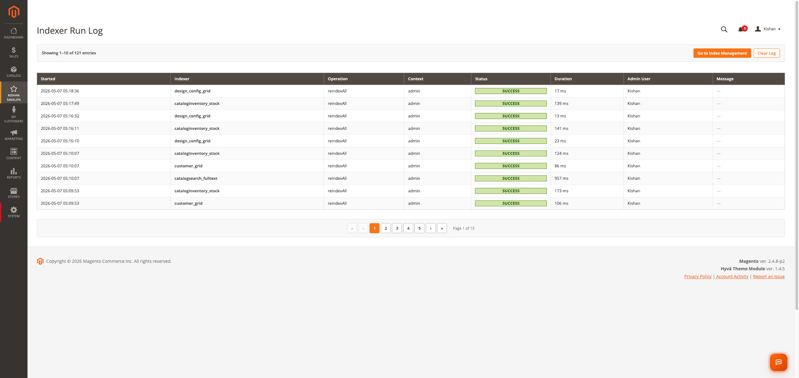

# Magento 2 Indexer Manager

Panth Indexer Manager adds reindex controls, a mode toggle, live status polling and a run history to the native Index Management grid in the Magento 2 admin. A plugin on `Magento\Indexer\Model\Indexer` records every `reindexAll`, `reindexRow` and `reindexList` call, whether it comes from the admin, the CLI, cron or the web API, in a run log table together with duration, status and error message. An email can be sent when a tracked run fails.

It is intended for store operators who need to reindex without shell access and for developers who want a history of indexer runs. The module is admin-only: it ships no storefront layouts, templates or assets, so it works with any theme.

Product page: [Magento 2 Indexer Manager](https://kishansavaliya.com/magento-2-indexer-manager.html)



## Features

- "Reindex" and "View" buttons on every row of the native Index Management grid.
- "Reindex Selected", "Reindex All" and "Reindex Invalid" buttons injected into the grid's mass-action toolbar, plus a "Reindex now (Panth)" option in the native Actions dropdown.
- Click on a "Mode" cell (or Tab to it and press Enter or Space) to switch that indexer between "Update by Schedule" and "Update on Save". Clicking a row button or a Mode cell does not change the row selection.
- "Live polling" toggle, "Refresh now" button and "Open Run Log" link. While polling is on, status, mode, updated time and last tracked run are refreshed every 5 seconds by default; the interval is configurable (Live Polling Interval, 2 to 3600 seconds) and shown in the toggle label, for example "Live polling (5s)".
- "Last Tracked Run" column showing the start time and duration of the latest recorded run of each indexer.
- Details modal (the "View" button) with title, description, mode, status, schedule state including the changelog backlog count, last update, and the 10 most recent tracked runs.
- The backlog of an "Update by Schedule" indexer is the number of distinct entity IDs in its changelog above the view's processed version, counted in the database with one bounded query per view (at most 10,000 are counted; larger backlogs are shown as "10000+"). The changelog rows themselves are never loaded into PHP, so polling stays cheap on stores with large backlogs.
- The "Last Tracked Run" column loads the latest run of every indexer on the grid page with a single query instead of one query per row.
- Run Log page listing started time, indexer, operation, context, status, duration, admin user and message, 10 entries per page, with keyword search, Indexer, Status and Context filters, sortable columns and a "Clear Log" action.
- All dates (the "Updated" column after polling, "Last Tracked Run", the details modal and the Run Log) are shown in the admin locale format and the store timezone, the same way as the native "Updated" column. They are stored in UTC.
- Two reindex strategies: "Standard (synchronous)" runs the reindex inside the admin request; "Queue (deferred)" publishes the indexer id to the `panth.indexer_manager.reindex` message queue topic and a consumer runs the reindex.
- Daily cron job that deletes run log rows older than "Log Retention (days)".
- Optional email on reindex failure using the "Indexer Manager - Reindex Failure" email template.
- Three ACL resources ("Manage Indexers", "Run Log", "Configuration") and an "Indexer Manager" entry under the "Panth Infotech" admin menu.
- Translations in `i18n/en_US.csv`.



## Compatibility

| Platform | Versions |
|---|---|
| Magento Open Source | 2.4.4, 2.4.5, 2.4.6, 2.4.7, 2.4.8 |
| Adobe Commerce | 2.4.4, 2.4.5, 2.4.6, 2.4.7, 2.4.8 |
| PHP | 8.1, 8.2, 8.3, 8.4 (`~8.1.0||~8.2.0||~8.3.0||~8.4.0`) |

Composer constraints on Magento packages: `magento/framework` ^103.0, `magento/module-backend` ^102.0, `magento/module-indexer` ^100.4, `magento/module-store` ^101.1, `magento/module-config` ^101.2.

## Requirements

- Magento Open Source or Adobe Commerce 2.4.4 to 2.4.8.
- PHP 8.1, 8.2, 8.3 or 8.4.
- `mage2kishan/module-core` ^1.0 (module `Panth_Core`), installed by Composer as a dependency. It provides the "Panth Extensions" configuration tab and the "Panth Infotech" admin menu that this module hooks into.
- For the "Queue (deferred)" strategy: a running consumer for the `panth.indexer_manager.reindex` queue. The queue uses the `db` connection, so no AMQP broker is required.
- For failure emails: a working Magento email transport.
- Magento cron configured, so that the log retention job runs.

## Installation

```bash
composer require mage2kishan/module-indexer-manager
bin/magento module:enable Panth_Core Panth_IndexerManager
bin/magento setup:upgrade
bin/magento setup:di:compile
bin/magento setup:static-content:deploy -f
bin/magento cache:flush
```

`setup:di:compile` is only needed in production mode. `setup:static-content:deploy -f` is needed because the module ships CSS and JavaScript under `view/adminhtml/web`.

Check the module status:

```bash
bin/magento module:status Panth_IndexerManager
```

The module is disabled by default in configuration. Set "Enable Indexer Manager" to Yes (see below) to turn on run tracking.

## Configuration

Go to Stores > Configuration > Panth Extensions > Indexer Manager. All settings are available at the default scope only.



### General

| Setting | Default | What it does |
|---|---|---|
| Enable Indexer Manager | No | When No, run tracking is switched off (and with it failure emails, which are only sent for tracked failures) and the "Queue (deferred)" strategy is ignored, so reindexing runs in the request. The grid controls and the Run Log page stay available. |
| Reindex Strategy | Standard (synchronous) | "Standard (synchronous)" runs the reindex in the admin request. "Queue (deferred)" publishes to the message queue; a consumer must be running. Shown when "Enable Indexer Manager" is Yes. |
| Live Polling Interval (seconds) | 5 | How often the Index Management grid polls indexer status while live polling is on. Values outside 2 to 3600 are clamped. Shown when "Enable Indexer Manager" is Yes. |

### Live Tracking

| Setting | Default | What it does |
|---|---|---|
| Track Reindex Runs | Yes | Stores start time, end time, duration, status and message of every indexer run in the run log table. Shown when "Enable Indexer Manager" is Yes. |
| Log Failures Only | No | When Yes, the log row of a successful run is deleted when the run finishes, so only failed runs remain. Shown when "Enable Indexer Manager" and "Track Reindex Runs" are Yes. |
| Log Retention (days) | 30 | The daily cron job deletes log rows whose start time is older than this many days. The job does nothing when the value is 0. Shown when "Enable Indexer Manager" and "Track Reindex Runs" are Yes. |

### Notifications

| Setting | Default | What it does |
|---|---|---|
| Email on Reindex Failure | No | When Yes, an email is sent each time a tracked run ends with an error. |
| Notification Email | (empty) | Recipient address(es); a comma-separated list such as `ops@example.com, alerts@example.com` is supported and validated address by address. No email is sent while this is empty. Shown when "Enable Indexer Manager" and "Email on Reindex Failure" are Yes. |

Configuration paths:

- `panth_indexer_manager/general/enabled`
- `panth_indexer_manager/general/strategy` (`standard` or `queue`)
- `panth_indexer_manager/general/poll_interval` (seconds, default `5`)
- `panth_indexer_manager/tracking/enabled`
- `panth_indexer_manager/tracking/track_failures_only`
- `panth_indexer_manager/tracking/retention_days`
- `panth_indexer_manager/notifications/notify_on_failure`
- `panth_indexer_manager/notifications/notify_email`

Admin menu entries under "Panth Infotech" > "Indexer Manager":

- "Index Management" opens the native grid (`indexer/indexer/list`) with the added controls.
- "Run Log" opens the module's log page (`panth_indexer_manager/log/index`).
- "Configuration" opens the configuration section above.

## Usage

### Index Management grid

- "Reindex" on a row runs `reindexAll` for that indexer according to the configured strategy. The toast shows "<title> reindexed in <n> ms" for a synchronous run or "<title> queued for reindex" when queued. A synchronous run is refused with "<title> is already being reindexed." when the same indexer is already running.
- "Reindex Selected" runs the ticked rows, "Reindex All" runs every indexer and "Reindex Invalid" runs the indexers whose status is "Reindex required". Each indexer is dispatched separately and the toast reports how many succeeded (or were queued) and how many failed.
- "Reindex now (Panth)" in the native Actions dropdown dispatches the selected indexers according to the configured strategy, like the "Reindex Selected" button, and reloads the page with success, warning or error messages. It requires the "Manage Indexers" ACL resource.
- Clicking a "Mode" cell switches the indexer between "Update by Schedule" and "Update on Save" and confirms with a toast.
- "View" opens the details modal. It has a "Reindex this" button.
- Live polling is on by default when the page loads. "Refresh now" polls immediately and the "Updated HH:MM:SS" text shows the last refresh time. Rows whose indexer is currently working show a spinner.
- The module adds no "invalidate" or "reset" actions; use the native Magento tools for those.





### Run tracking

When "Enable Indexer Manager" and "Track Reindex Runs" are both Yes, the plugin on `Magento\Indexer\Model\Indexer` writes a row with status `running` before the reindex starts and updates it with status `success` or `error`, the end time and the duration in milliseconds when it ends. Error messages are stored up to 4000 characters and the exception is rethrown, so Magento's own behaviour is unchanged.

The `context` column is derived from the application area: `admin` for the admin, `cron` for cron, `api` for REST, SOAP and GraphQL, `cli` for everything else (including `bin/magento indexer:reindex`, which runs in the admin area from the command line, and the queue consumer), and `unknown` when no area code is set. The `admin_user` column holds the admin user name when the run was triggered from an admin session.

### Run Log page

"Panth Infotech" > "Indexer Manager" > "Run Log" lists the newest runs first, 10 per page, with "Success", "Error" and "Running" badges and the stored message. The filter bar searches the indexer id, message and admin user by keyword and filters by Indexer, Status and Context; "Reset" clears the filters. Click a column header to sort by it, click again to reverse the order. Filters and sorting are kept while paging, and a page number past the end shows the last page. When nothing matches, the grid says so and offers a "Reset filters" link. "Go to Index Management" links back to the grid. "Clear Log" asks for confirmation and then deletes every row of the run log table. It is sent as a POST request with the admin form key.



### Queue strategy

With "Reindex Strategy" set to "Queue (deferred)", the "Reindex" and mass buttons publish the indexer id to the topic `panth.indexer_manager.reindex`. Start the consumer to process the queue:

```bash
bin/magento queue:consumers:start panth.indexer_manager.reindex
```

The consumer (`Panth\IndexerManager\Model\Queue\ReindexConsumer::process`, `maxMessages` 1000) loads the indexer and calls `reindexAll`. A message is skipped, with an info log entry, when the same indexer is already being reindexed. Failures are written to the Magento log with the prefix `[Panth IndexerManager]` and rethrown.

### Cron

| Job | Schedule | What it does |
|---|---|---|
| `panth_indexer_manager_cleanup_run_log` | `0 3 * * *` (group `default`) | Deletes run log rows whose `started_at` is older than "Log Retention (days)" days (UTC). Skips when the value is 0 or less. Logs the number of deleted rows at info level and any failure as a warning. |

### Console commands

The module adds no console commands.

### Notifications and logging

When a tracked run fails and "Email on Reindex Failure" is Yes with at least one "Notification Email", an HTML email is sent through the `panth_indexer_manager_failure` template. The subject is `[Indexer Manager] <indexer id> reindex failed on <store name>`; the body lists indexer, operation, context, start and end time, duration, admin user, store, the error message and the store URL. The sender is the "General Contact" identity of the current store. A failure to send is written to the Magento log as a warning and does not affect the reindex.

All log lines written by the module are prefixed with `[Panth IndexerManager]`.

## Developer Notes

- Module name: `Panth_IndexerManager`; loads after `Panth_Core`, `Magento_Backend` and `Magento_Indexer`.
- Composer package: `mage2kishan/module-indexer-manager`; namespace `Panth\IndexerManager`.
- Admin route front name `panth_indexer_manager`; the module also registers on the `indexer` route (before `Magento_Indexer`) for the `indexer/indexer/massPanthReindex` action.

Key classes:

- `Plugin\IndexerTrackingPlugin`: around plugins on `reindexAll`, `reindexRow` and `reindexList` of `Magento\Indexer\Model\Indexer` (plugin name `panth_indexer_manager_track_runs`, sort order 100).
- `Model\Tracker`: `start()`, `finish()`, `getLatest()`, `getLatestForAll()`; resolves context and admin user.
- `Model\Notifier`: `notifyFailure()` sends the failure email.
- `Model\Queue\ReindexDispatcher`: `dispatch()` validates the indexer id and runs synchronously or publishes to `ReindexDispatcher::TOPIC`; `reindexNow()` runs `reindexAll` under a per-indexer lock and returns false when the indexer is already running.
- `Model\Queue\ReindexConsumer`: `process()` queue handler.
- `Model\Indexer\StateProvider`: `getAll()` and `getOne()` build the JSON rows used by polling and the details modal.
- `Model\Config`: typed accessors and `XML_PATH_*` constants for every setting.
- `Model\RunLog`, `Model\ResourceModel\RunLog`, `Model\ResourceModel\RunLog\Collection`: the run log entity (event prefix `panth_indexer_manager_run_log`).
- `Controller\Adminhtml\Manage\Run`, `MassRun`, `Mode`, `Status`, `Details`: JSON endpoints used by the grid JavaScript (ACL `Panth_IndexerManager::manage`). `Run`, `MassRun` and `Mode` accept POST requests only.
- `Controller\Adminhtml\Log\Index` and `Clear`: Run Log page and clear action (ACL `Panth_IndexerManager::log`). `Clear` accepts POST requests only.
- `Controller\Adminhtml\Indexer\MassPanthReindex`: native mass action (ACL `Panth_IndexerManager::manage`).
- `Block\Adminhtml\Indexer\Enhancer`, `Block\Adminhtml\Indexer\Grid\Column\Renderer\Actions`, `Block\Adminhtml\Indexer\Grid\Column\Renderer\LastRun`, `Block\Adminhtml\Log\Listing`.
- `Cron\CleanupRunLog`.

Layout handles: `indexer_indexer_list_grid` (adds the columns, the mass action and the enhancer block) and `panth_indexer_manager_log_index`. Web assets: `view/adminhtml/web/css/admin.css` and `view/adminhtml/web/js/native-grid-enhancer.js` (plain JavaScript, no RequireJS or Knockout).

ACL resources (under `Panth_Core::panth_extensions`):

- `Panth_IndexerManager::indexer_manager` ("Indexer Manager")
  - `Panth_IndexerManager::manage` ("Manage Indexers")
  - `Panth_IndexerManager::log` ("Run Log")
  - `Panth_IndexerManager::config` ("Configuration")

Database table `panth_indexer_manager_run_log` (declared in `etc/db_schema.xml`):

| Column | Type | Notes |
|---|---|---|
| `log_id` | int unsigned | primary key, auto increment |
| `indexer_id` | varchar(64) | indexed |
| `operation` | varchar(32) | `reindexAll`, `reindexRow` or `reindexList` |
| `context` | varchar(32) | `admin`, `cli`, `cron`, `api` or `unknown` |
| `status` | varchar(16) | `running`, `success` or `error`; indexed |
| `started_at` | datetime | UTC; indexed |
| `finished_at` | datetime | nullable |
| `duration_ms` | int unsigned | nullable |
| `message` | text | error message |
| `admin_user` | varchar(128) | nullable |

Message queue: topic `panth.indexer_manager.reindex` (payload: indexer id string), exchange `magento-db`, queue and consumer `panth.indexer_manager.reindex` on the `db` connection.

## Uninstallation

```bash
bin/magento module:disable Panth_IndexerManager
composer remove mage2kishan/module-indexer-manager
bin/magento setup:upgrade
bin/magento setup:di:compile
bin/magento cache:flush
```

The `panth_indexer_manager_run_log` table is declared through declarative schema, so `setup:upgrade` removes it once the module is gone; export it first if you want to keep the history. The configuration values under `panth_indexer_manager/*` in `core_config_data`, any unprocessed messages for the `panth.indexer_manager.reindex` queue and the `cron_schedule` rows of the cleanup job are not removed. `Panth_Core` stays installed unless you remove it separately.

## Support

- Product page: [Magento 2 Indexer Manager](https://kishansavaliya.com/magento-2-indexer-manager.html)
- Contact form: [kishansavaliya.com/contact](https://kishansavaliya.com/contact)
- Email: kishansavaliyakb@gmail.com
- Issues: [GitHub issues](https://github.com/mage2sk/module-indexer-manager/issues)

## License

Proprietary, as declared in `composer.json`. The package is published on Packagist and can be installed with Composer; see the product page for the terms of use.

## Changelog

See [CHANGELOG.md](CHANGELOG.md).

## Links

- Website: [kishansavaliya.com](https://kishansavaliya.com)
- All extensions: [Magento extensions catalogue](https://kishansavaliya.com/magento-extensions.html)
- GitHub: [mage2sk/module-indexer-manager](https://github.com/mage2sk/module-indexer-manager)
- Packagist: [mage2kishan/module-indexer-manager](https://packagist.org/packages/mage2kishan/module-indexer-manager)
